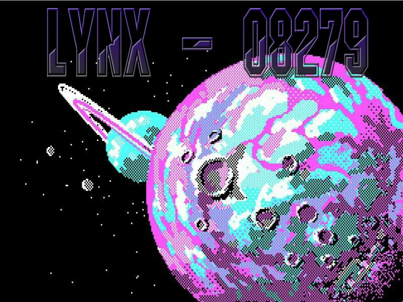

# 🌌 Space Shooter Game Lynx-08279 - Js Capstone Project 🌌

## 📑 Table of Contents

* [About the Project](#about-the-project)
  * [Built With](#built-with)
* [Contact](#contact)
* [Acknowledgements](#acknowledgements)

<!-- ABOUT THE PROJECT -->
## 📄 About The Project

This is a space shooter game built with [Phaser 3](https://phaser.io/phaser3) framework for the final JavaScript Course's Capstone Project.

See [specifications](https://www.notion.so/Shooter-game-203e819041c7486bb36f9e65faecba27) for more detailed information about the criteria.

The first convention is to get inspiration of an already in-built space shooter Phaser game, [click here](https://learn.yorkcs.com/category/tutorials/gamedev/phaser-3/build-a-space-shooter-with-phaser-3/), and create our own game ideas, Lynx-08279 is the result of this process, designed with the following step of ideas.

### 👉 History

Lynx-08279 is the space ship that gives the name to the game, and the player is the aerospace engineer pilot. The purpose of the game is to show the cycle loop suffered from our unnamed protagonist inside space/time distortion. 
Everything inside looks dangerous and, down there, you can find antimatter organisms and gravity distortions that chase you all the time, making you explode if collide. The Lynx-08279 has limited technology, only one electromagnetic field generator that protects the ship against three big energy collisions, but not against antimatter organisms, to avoid collisions you have to shot the 'antimatter entities', stealing their energy power.
So that's it, you can resist three shots of plasma, but not more, and you will die if you collide. But even if you die, you can use the distortion to go back in time and try to obtain more antimatter energy power in order to scape.

### 👉 Art

The illustrations of Lynx-08279 are an old school pixel representation of the deep and far space, and gives you the opportunity to appreciate the beauty of the pixel art.
The music is chosen to be emotional and quiet, with weird surprises from time to time, showing the drama, dreams and emotions of the protagonist.  
The main menu music represents hope, the gameplay music shows the histrionic feelings of the journey, the game over music is the sadness, and the rest of all the sounds represents the journey's weirdness.

### 👉 Code

The code is written in ES6 JavaScript modules encapsulating the scenes of the game, each scene is linked to others by Phaser 3 events, giving coherence to the game, and the code is tested using jest env configuration. 
The set up environment is made up with yarn package manager, giving stability to the code, and providing the web server needed to display the game on the browser screen.
The game is shown in a canvas / webgl doom element created by Phaser dependency.
The score current score and the highest score are stored in the web browser using localStorage, and the record of the best scores are given and received by an external API service, allowing the user to submit or not his/her score and username and see top five user's names and scores.

### 👉 Commands

To move around you push you computer's keyboard, in specific the UP / DOWN / LEFT /RIGHT keys, 

and for shooting you press space bar. 

### Built With

* JavaScript
* Phaser 3
* Yarn
* Jest
* LocalStorage
* [Leaderboard API service](https://www.notion.so/Leaderboard-API-service-24c0c3c116974ac49488d4eb0267ade3)
* Git / Github
* [Heroku](https://www.heroku.com/)

<!-- CONTACT -->
## 📨 Contact

🙎 Guadalupe Rangel - kanemekanik@gmail.com ☄️

<!-- ACKNOWLEDGEMENTS -->
## Acknowledgements

* [Microverse](https://www.microverse.org/)
* [OpenGameArt](https://opengameart.org/)
* [Exewin Game Developer](https://github.com/exewin)
*
